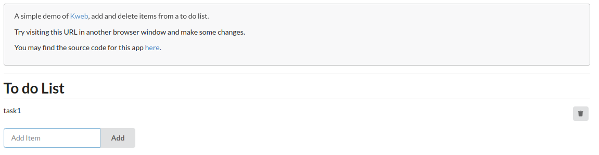

# Todo List App

This app showcases many of kweb's features. Use `gradlew run` to start 
the server, and then open http://localhost:7659 in your browser. Try 
visiting the same list URL in two different browser windows and notice
how they synchronize in real time.

This project also demonstrates how to use [shoebox](https://github.com/kwebio/shoebox)
for reactive persistence.

Запуск:

````shell
export JAVA_HOME=/usr/lib/jvm/java-17-openjdk-amd64/

# export JAVA_HOME=/usr/lib/jvm/java-8-openjdk-amd64/ - НЕ РАБОТАЕТ
# export JAVA_HOME=/usr/lib/jvm/adopt-jdk-16.0.2/ - НЕ РАБОТАЕТ

./gradlew run
````
или

````shell
./run.sh
````

Открыть http://localhost:7659



Ссылки:

[https://v.perm.ru/index.php/component/content/article/kweb-example](https://v.perm.ru/index.php/component/content/article/kweb-example)